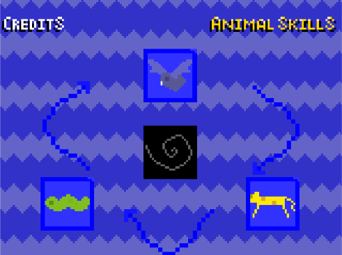
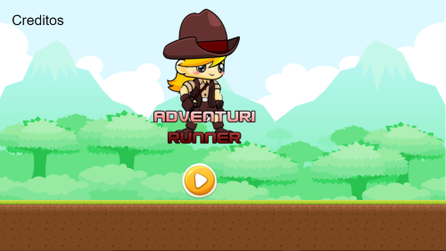
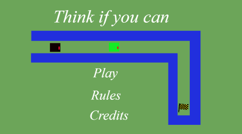
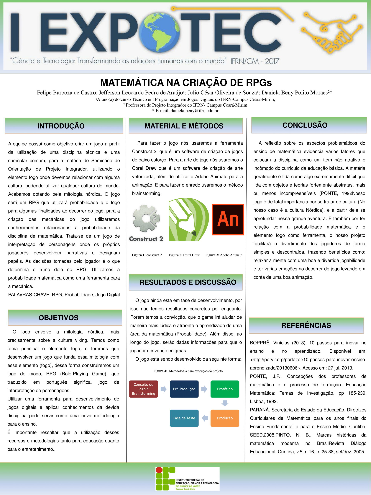
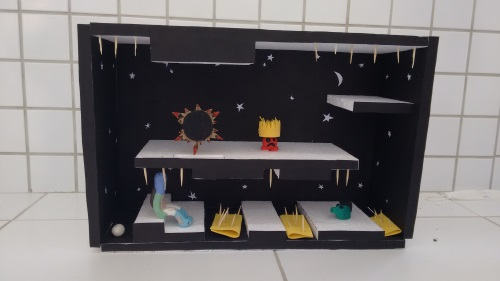
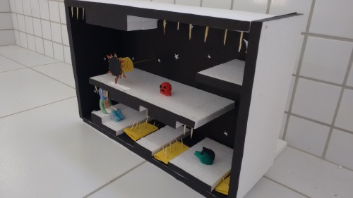
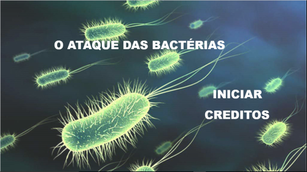
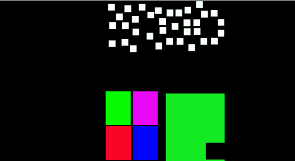
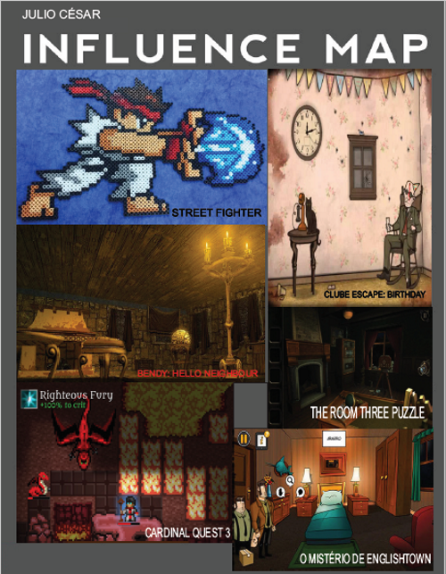

# Quem sou eu 

    
  
  * Sou Julio César, 18 anos, curso programação de jogos digitais, no Instituto Federal de Educação, Ciências e Tecnologia do Rio Grande do Norte(IFRN), Campus Ceará-Mirim. Estou atualmente no 4º ano da forma integrada.  
  
## Contatos pessoais  
  
  [Facebook : César Souza](https://www.facebook.com/juliocesar.oliveiradesouza.98/)  
    

  [Instagram : cesar_souza45](https://www.instagram.com/cesar_souza45/)  
    
  
  E-mails: juliocesarabc45@gmail.com  
           juliocesarabc45@hotmail.com  
           julio.souza@academico.ifrn.edu.br  
           julio.souza@escolar.ifrn.edu.br  
       
  [Steam : juliocesarabc45](http://steamcommunity.com/profiles/76561198369015681/home)    
    
  
  * * *
  

# Portfólio

## Games  

* Jogo sobre a cultura dos animas. Jogo retrata as habilidades de 3 animais, largato, leopardo e passaro. Esse jogo só está disponível para computadores.  
[Animal Skills](https://cesarabc45.github.io/Animal%20Skills/)  
  
* Equipe: [Arthur Soares](https://reiarthursr.github.io)  

* É um jogo que tem com personagem principal uma garota, essa garota percorre caminhos coletandos pergaminhos e moedas. É um jogo em touch, que funciona tanto nas plataformas de celulares e computadores.  
[Adventuri Runner](https://cesarabc45.github.io/AdventuriRunner/)  
  
* Equipe: [Tailson Ferreira](https://tayllson.github.io/)    

* É um jogo de labirinto, que tem como objetivo chegar no final do labirinto sem ser derrotado pelos inimigos.  
[Pense se você puder](https://jefferson141.github.io/Pense%20se%20voc%C3%AA%20puder/)  
  
* Equipe: [Jefferson Leocardo](https://jefferson141.github.io/) e [João Kennedy](https://kkenedy.github.io/)  

* * *  

## Artes dos jogos 

* _Os jogos que eu desenvolvi, junto com alguns paceiros, na maioria das vezes foi com artes já feitas, ou algum dos meus paceiros fizeram. Sou mais focado na programação dos jogos._  

* * *  

## Projetos desenvolvidos 

* Projeto integrador(PI) - MATEMÁTICA NA CRIAÇÃO DE RPG´S  

* Orientadores: Daniela Beny Polito Moraes.  

* Equipe: [Felipe Barboza](https://felipecastroifrn.github.io/) e [Jefferson Leocardo](https://jefferson141.github.io/)  

   

* Projeto de Interface - Maquete 3D de um jogo    

* Orinetador: Marcelo de Barros.  

* Equipe: [Arthur Soares](reiarthursr.github.io) , [Felipe Barboza](felipecastroifrn.github.io) e Marcelo Vitaliano.    

  

  

* Projeto integrador(PI) - Torre Defence.  

* Orientadores: Marcelo de Barros.     

* Equipe: [Jefferson Leocardo](https://jefferson141.github.io/) e [João Kennedy](https://kkenedy.github.io/)     
  

* * *

## Trabalhos relacionados 

[Jogo 5seg](https://cesarabc45.github.io/5seg/)    
  
Equipe: [Mychellangello](https://mychellangello.github.io/)  
Disciplinas: Game Design e Motores.  

[Tutorial Multi-idomas](https://drive.google.com/open?id=0B-i9Pv-U5eQONERXWlZmZmhLQWRmVGFndzJjeHZyMWJSdjJn)  
Equipe: [Jefferson Leocardo](https://jefferson141.github.io/) e [João Kennedy](https://kkenedy.github.io/)   

#### Influence map  
  
Disciplina: Motores.  

#### Jogo da velha em C++  

* Jogo Desenvolvido em linguagem C++ para a matéria de Programação Orientada a Objetos (POO) 

[Jogo da Velha em C++](https://drive.google.com/open?id=1GxmH5-X46kaDyO-meNmpO_aeYoWoagdf)  
Disciplina:  Motores.

#### Releitura de Pôsters  

* Inspiração: Capitão América  

  

* Disciplina: Design  

#### Trabalho de Multimídia  

[Multimidia](https://cesarabc45.github.io/Multimidia/)     
* Equipe: [Arthur Soares](https://reiarthursr.github.io) , [Felipe Barboza](felipecastroifrn.github.io) e [Jefferson Leocardo](https://jefferson141.github.io/)  
* Disciplina: Multimídia.

* * *

## Apresentação  

* Apresentei um projeto da diciplina PI- Projeto integrador, na I Exportec, no  IFRN-CAMPUS Ceará-Mirim/RN. Tendo como título Matemática na crianção de RPG's. Esse jogo tem como objetivo relacionar a probabilidade matemática com cultura nórdica , conhecida como a cultura vikings, também iremos relacionar o elemento fogo.    

* * *  

**É só isso que temos...**    

* * *  

