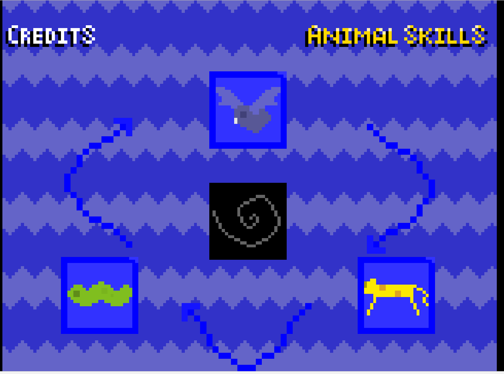

Text can be **bold**, _italic_, or ~~strikethrough~~.
Criando a _minha_ **página** ~~principal~~ 

# Quem sou eu 

  Sou estudante de jogos que gosta da aula do professor Marcelo.

# Produções  

## Game  

  

[jogo 2 Oficina : AdventuriRunner](https://cesarabc45.github.io/AdventuriRunner/)  

## Artes  
  
  

## Apresentação  
* Aula de Música  
* Aula de teatro  
* Aula de jogos  
1. Marcelo  
2. Durval  
3. Tiago  

* * *

** negrito  
_ italico  
~~ riscando  
  dois espaços para pular linha  
3* adiciona uma linha horizontal  
#s uma ou mais hashtags criam capítulos ou sub  
*s  asterisco adicionam ula lista não numerada  
is  numeros adicionam uma lista numerada   
  
  * * *
